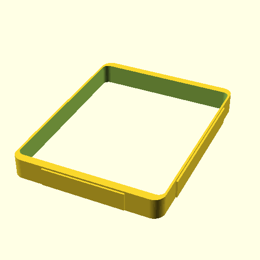

# Oobb Part Liner Packaging Tin Hinged Lid 8 Width 10 Height 18 mm Depth Packaging Tin Hinged Lid 169 mm Width 130 mm Height 18 mm Depth 350 Ml Tinware Direct T4066 Extra  

note: This is part of OOMP the Oopen Organization Method For Parts. For more details: https://github.com/oomlout/oomp_base

##  part details
  

### name
* name: Oobb Part Liner Packaging Tin Hinged Lid 8 Width 10 Height 18 mm Depth Packaging Tin Hinged Lid 169 mm Width 130 mm Height 18 mm Depth 350 Ml Tinware Direct T4066 Extra
* name_short: 
### id
* oomp_id: oobb_part_liner_packaging_tin_hinged_lid_8_width_10_height_18_mm_depth_packaging_tin_hinged_lid_169_mm_width_130_mm_height_18_mm_depth_350_ml_tinware_direct_t4066_extra
  * classification: oobb
  * type: part
  * size: liner_packaging_tin_hinged_lid
  * color: 
  * description_main: 8_width_10_height_18_mm_depth
  * description_extra: packaging_tin_hinged_lid_169_mm_width_130_mm_height_18_mm_depth_350_ml_tinware_direct_t4066_extra
  * manufacturer: 
  * part_number: 
  * bip 39 word 2: cook hamster
  * bip 39 word 3: cook hamster vacuum
  * bip 39 word: cook hamster vacuum replace ocean garbage hotel kind region circle note assume

### other_codes
* short_code: 
* oomp_word: fountain snowman chicken
* oomp_word_emoji :fountain: :snowman: :chicken:
* md5_6_alpha: 8phl6
* md5_6: df2d4a

### oomlout_oomp_utility_custom_data_manipulation
#### label print
[3x2](http://192.168.1.245:1112/?label=oomp%208phl6)
[3x2_oomp_table](http://192.168.1.108:1112/?label=oomp%208phl6)
[2x1](http://192.168.1.242:1112/?label=oomp%208phl6)
[6x4](http://192.168.1.55:1112/?label=oomp%208phl6)    

#### link

                              

#### price

### all codes 
| key | value |  
| --- | --- |  
| classification | oobb |  
| classification_name | Oobb |  
| color |  |  
| color_name |  |  
| description_extra | packaging_tin_hinged_lid_169_mm_width_130_mm_height_18_mm_depth_350_ml_tinware_direct_t4066_extra |  
| description_extra_name | Packaging Tin Hinged Lid 169 mm Width 130 mm Height 18 mm Depth 350 Ml Tinware Direct T4066 Extra |  
| description_main | 8_width_10_height_18_mm_depth |  
| description_main_name | 8 Width 10 Height 18 mm Depth |  
| directory | parts/oobb_part_liner_packaging_tin_hinged_lid_8_width_10_height_18_mm_depth_packaging_tin_hinged_lid_169_mm_width_130_mm_height_18_mm_depth_350_ml_tinware_direct_t4066_extra |  
| full_rotations | [0, 0, 0] |  
| full_shift | [0, 0, 0] |  
| github_link | https://github.com/oomlout/oomlout_oomp_part_src/tree/main/parts/oobb_part_liner_packaging_tin_hinged_lid_8_width_10_height_18_mm_depth_packaging_tin_hinged_lid_169_mm_width_130_mm_height_18_mm_depth_350_ml_tinware_direct_t4066_extra |  
| id | oobb_part_liner_packaging_tin_hinged_lid_8_width_10_height_18_mm_depth_packaging_tin_hinged_lid_169_mm_width_130_mm_height_18_mm_depth_350_ml_tinware_direct_t4066_extra |  
| id_oobb | oobb_part_oomlout_bolt_packaging_tin_hinged_lid_liner_packaging_tin_hinged_lid_8_width_10_height_18_mm_depth_packaging_tin_hinged_lid_169_mm_width_130_mm_height_18_mm_depth_350_ml_tinware_direct_t4066_extra |  
| kwargs | {'depth_start': 18, 'diameter_bottom_bend': 1, 'extra': 'packaging_tin_hinged_lid_169_mm_width_130_mm_height_18_mm_depth_350_ml_tinware_direct_t4066', 'filter': '', 'height': 10, 'height_start': 169, 'modes': ['3dpr'], 'navigation': True, 'oomp_classification': 'oobb', 'oomp_color': '', 'oomp_description_extra': 'packaging_tin_hinged_lid_169_mm_width_130_mm_height_18_mm_depth_350_ml_tinware_direct_t4066_extra', 'oomp_description_main': '8_width_10_height_18_mm_depth', 'oomp_manufacturer': '', 'oomp_mode': 'oobb', 'oomp_part_number': '', 'oomp_run': False, 'oomp_size': 'liner_packaging_tin_hinged_lid', 'oomp_type': 'part', 'overwrite': True, 'thickness': 18, 'thickness_bead': 1.5, 'thickness_tin': 0.5, 'typ': 'all', 'type': 'oomlout_bolt_packaging_tin_hinged_lid_liner_packaging_tin_hinged_lid', 'width': 8, 'width_start': 129} |  
| link_oomlout_label_2x1 | http://192.168.1.242:1112/?label=oomp%208phl6 |  
| link_oomlout_label_3x2 | http://192.168.1.245:1112/?label=oomp%208phl6 |  
| link_oomlout_label_3x2_oomp_table | http://192.168.1.108:1112/?label=oomp%208phl6 |  
| link_oomlout_label_6x4 | http://192.168.1.55:1112/?label=oomp%208phl6 |  
| manufacturer |  |  
| manufacturer_name |  |  
| md5 | df2d4a4da47a8dc57e4c7b6de11a297d |  
| md5_10 | df2d4a4da4 |  
| md5_5 | df2d4 |  
| md5_6 | df2d4a |  
| md5_6_alpha | 8phl6 |  
| name | Oobb Part Liner Packaging Tin Hinged Lid 8 Width 10 Height 18 mm Depth Packaging Tin Hinged Lid 169 mm Width 130 mm Height 18 mm Depth 350 Ml Tinware Direct T4066 Extra |  
| oomlout_detail_hierarchy_1 | oobb |  
| oomlout_detail_hierarchy_2 | part |  
| oomlout_detail_hierarchy_3 | liner_packaging_tin_hinged_lid |  
| oomlout_detail_hierarchy_4 | 18_mm_depth |  
| oomlout_detail_hierarchy_5 | 169_mm_width |  
| oomlout_detail_hierarchy_6 | 130_mm_height |  
| oomlout_detail_hierarchy_7 | 18_mm_depth |  
| oomlout_oomp_utility_custom_data_manipulation | True |  
| oomp_key | oomp_oobb_part_liner_packaging_tin_hinged_lid_8_width_10_height_18_mm_depth_packaging_tin_hinged_lid_169_mm_width_130_mm_height_18_mm_depth_350_ml_tinware_direct_t4066_extra |  
| oomp_word | fountain snowman chicken |  
| oomp_word_emoji | :fountain: :snowman: :chicken: |  
| oomp_word_emoji_list | [':fountain:', ':snowman:', ':chicken:'] |  
| oomp_word_list | ['fountain', 'snowman', 'chicken'] |  
| part_number |  |  
| part_number_name |  |  
| project_name | C:\gh\oomlout_bolt_packaging_tin_hinged_lid |  
| size | liner_packaging_tin_hinged_lid |  
| size_name | Liner Packaging Tin Hinged Lid |  
| type | part |  
| type_name | Part |  
